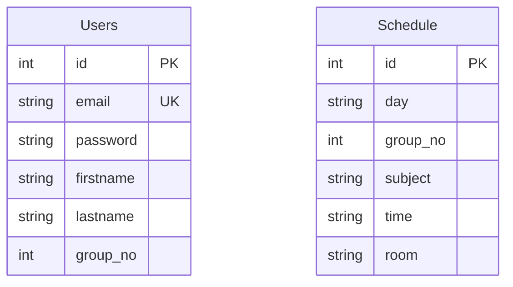

# Схема базы данных

## ER-диаграмма



## Описание таблиц

### Users
Таблица для хранения информации о пользователях.

| Поле | Тип | Описание |
|------|-----|----------|
| id | INTEGER | Первичный ключ, автоинкремент |
| email | TEXT | Email пользователя (уникальный) |
| password | TEXT | Пароль пользователя |
| firstname | TEXT | Имя пользователя |
| lastname | TEXT | Фамилия пользователя |
| group_no | INTEGER | Номер группы пользователя |

### Schedule
Таблица для хранения расписания занятий.

| Поле | Тип | Описание |
|------|-----|----------|
| id | INTEGER | Первичный ключ, автоинкремент |
| day | TEXT | День недели |
| group_no | INTEGER | Номер группы |
| subject | TEXT | Название предмета |
| time | TEXT | Время занятия |
| room | TEXT | Номер аудитории |

## Связи между таблицами

- Users.group_no -> Schedule.group_no (Many-to-One)
  - Одна группа может иметь много записей в расписании
  - Один пользователь принадлежит к одной группе

## Примеры данных

### Users
```sql
INSERT INTO Users (email, password, firstname, lastname, group_no)
VALUES 
    ('ivanov@bsu.by', '1111', 'Иван', 'Иванов', 1),
    ('petrova@bsu.by', '2222', 'Анна', 'Петрова', 2),
    ('smith@bsu.by', '3333', 'John', 'Smith', 3),
    ('lee@bsu.by', '4444', 'Min', 'Lee', 4);
```

### Schedule
```sql
INSERT INTO Schedule (day, group_no, subject, time, room)
VALUES 
    ('Понедельник', 1, 'Математика', '09:00', '101'),
    ('Понедельник', 1, 'Физика', '10:45', '202'),
    ('Вторник', 2, 'Программирование', '09:00', '303'),
    ('Вторник', 2, 'Базы данных', '10:45', '404');
```

## SQL-файл

Полная схема базы данных доступна в файле: [app/src/main/java/com/bsu/studymate/db/db.sql](https://github.com/fpmi-pmvs2025/pmvs13-lab8-studymate_team/tree/main/app/src/main/java/com/bsu/studymate/db/db.sql)